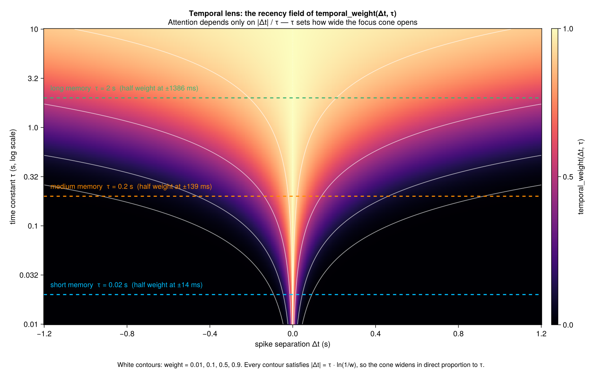
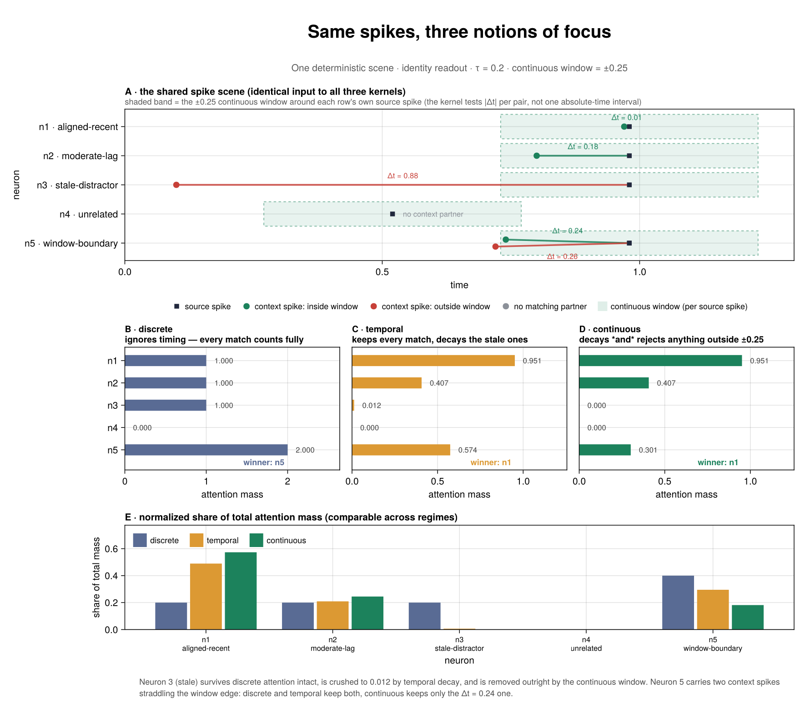
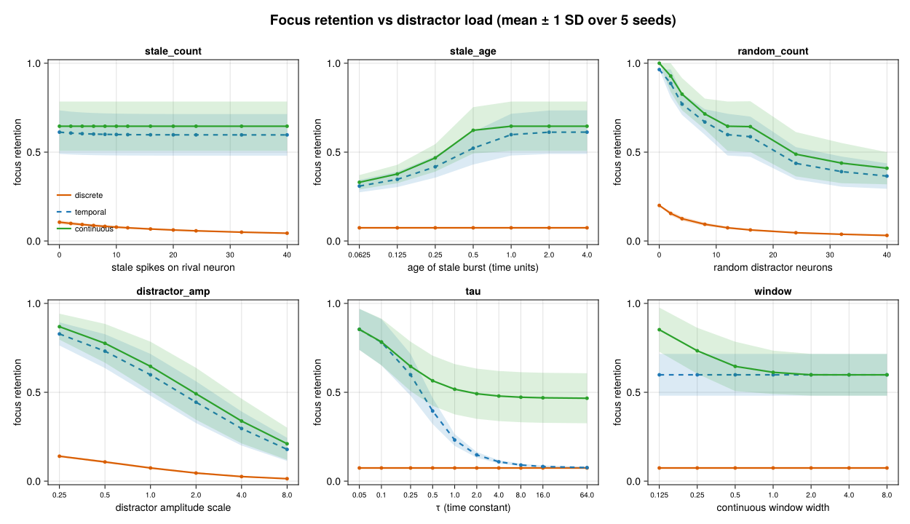
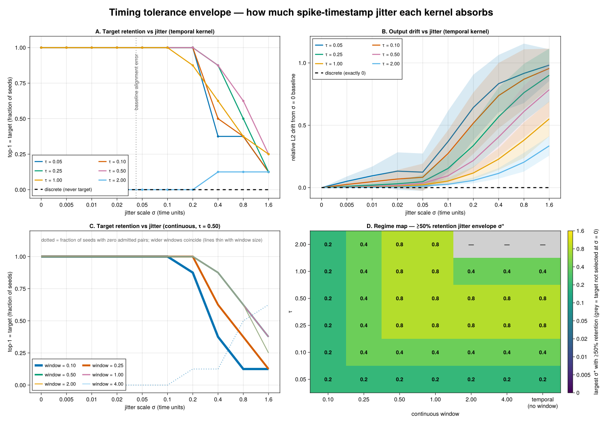
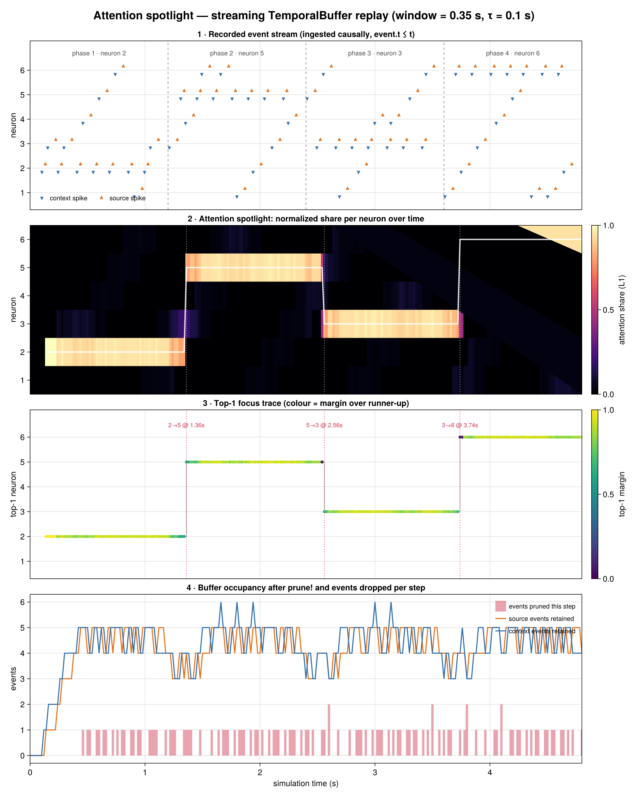
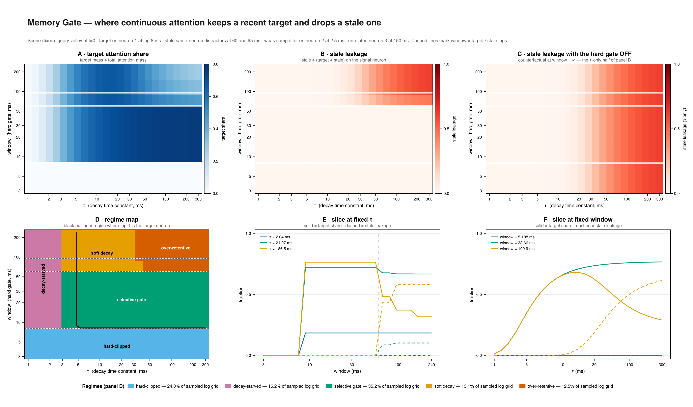
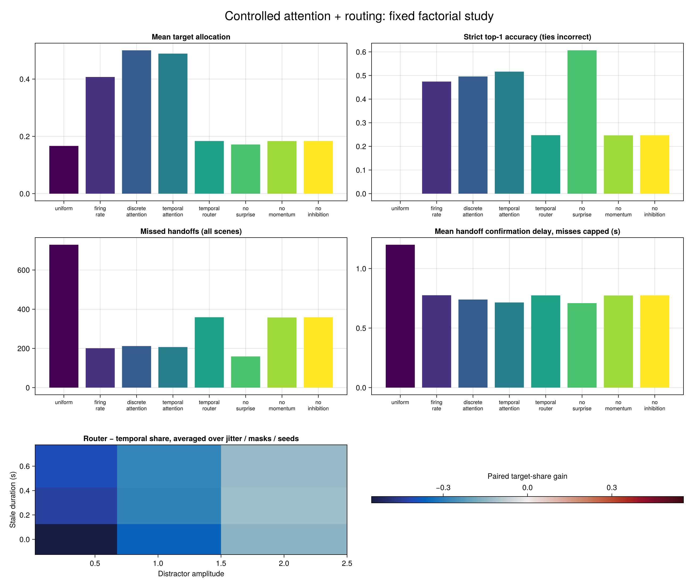
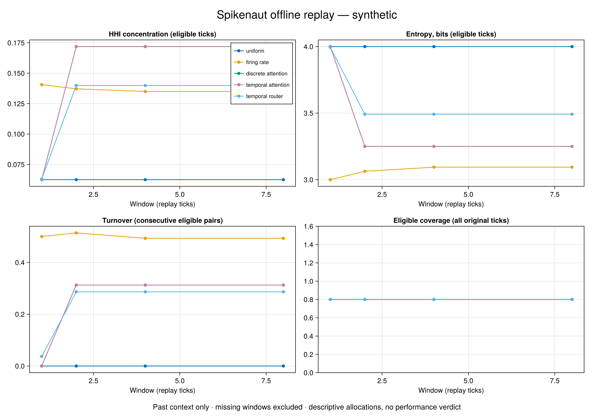

# Experiment Gallery

The research harness contains six deterministic, synthetic characterizations
of NeuroPulse's coincidence-attention kernels, plus a controlled causal
attention-and-routing study. They were ported with their
scenes, sweep grids, decision rules, and contrary findings from
`rmems/TemporalFocus.jl` at
`c0b51e2f7d473411390dc4a7667fd161326c6492`.

These results describe controlled spike scenes. They do not characterize a
real Spikenaut trace, prove training improvement, or claim a deployed runtime
benefit. Real trace characterization is a later downstream step with its own
recorded input digest and adapter boundary.

## Reproduce

From the repository root:

```bash
julia +1.12.7 --project=experiments -e 'using Pkg; Pkg.develop(path="."); Pkg.instantiate()'
julia +1.12.7 --project=experiments experiments/run_all.jl --out-dir experiments/results
```

Give concurrent runs distinct `--out-dir` roots so they do not overwrite one
another's artifacts.

Every entrypoint validates that the canonical NeuroPulse UUID resolves to
this NeuroPulse checkout. A run contains `config.toml`, `metrics.csv`,
`figure.png`, `summary.md`, `provenance.toml`, and snapshots of the exact
resolved Project and Manifest.

## Download the recorded run

[Download the characterization evidence bundle](assets/experiments/characterization-evidence.tar.gz)
contains all seven completed runs: configurations, numerical metrics, figures,
interpretations, source/input hashes, and resolved environment snapshots.
The archive includes the additional Temporal Lens and Focus Under Fire figures,
and their digests are recorded in each run's provenance. These runs were
generated from clean NeuroPulse commit `14e68ac` on Julia 1.12.7.

Archive SHA-256: `085d969071f6cd702a614b5bccf6a54261b7155e90e1a24c0523725b2e9ee8c7`. The archived environment records the original
local checkout path; follow the setup above with `Pkg.develop(path=".")` to
bind the canonical UUID to your checkout when reproducing.

The archive also retains the package name recorded by that historical run.
Those bytes stay unchanged as provenance. New runs from the renamed checkout
record `NeuroPulse`; compare their numerical CSVs with the archive while
expecting timestamps and package/config provenance to differ.

## Controlled findings

| Experiment | Controlled question | Observed verdict |
|---|---|---|
| [Temporal Lens](https://github.com/rmems/NeuroPulse.jl/blob/main/experiments/temporal_lens.jl) | How does coincidence weight vary over `Δt × τ`? | The sampled field is symmetric, follows the exponential ratio law, and agrees bitwise with the Float32 reference over the grid. |
| [Three Regimes](https://github.com/rmems/NeuroPulse.jl/blob/main/experiments/three_regimes.jl) | What do discrete, temporal, and continuous kernels preserve on the same scene? | Discrete keeps every same-neuron match, temporal decays separated pairs, and continuous also rejects pairs outside its hard window. |
| [Focus Under Fire](https://github.com/rmems/NeuroPulse.jl/blob/main/experiments/focus_under_fire.jl) | How does controlled distractor load affect focus? | The pre-registered sweep separates the kernel behaviors; this is robustness on synthetic distractors, not a workload claim. |
| [Jitter Test](https://github.com/rmems/NeuroPulse.jl/blob/main/experiments/jitter_test.jl) | How much synthetic timestamp jitter can each configuration absorb? | Discrete attention is invariant to timestamp jitter; temporal tolerance varies non-monotonically with `τ` on the fixed scene. |
| [Attention Spotlight](https://github.com/rmems/NeuroPulse.jl/blob/main/experiments/attention_spotlight.jl) | How does focus move as deterministic buffers fill and prune? | The replay produces four stable focus segments and three handoffs while recording the exact generated scenario. |
| [Memory Gate](https://github.com/rmems/NeuroPulse.jl/blob/main/experiments/memory_gate.jl) | Where does the `τ × window` plane retain a target and reject stale pairs? | The grid contains clipped, decay-starved, selective, soft-decay, and over-retentive regimes; the best region is a corridor rather than a unique point. |

## Rendered outputs

### Temporal Lens



### Three Regimes



### Focus Under Fire



### Jitter Test



### Attention Spotlight



### Memory Gate




## Controlled attention plus routing

The routing study reuses the spotlight timing and target sequence (2 → 5 → 3 → 6),
with five observed consecutive correct samples required to confirm each handoff.
The full fixed grid contains 243 paired scenes: distractor amplitudes
`[0.35, 1.0, 2.0]`, stale previous-target durations `[0, 0.25, 0.60]` seconds,
independent timestamp jitter amplitudes `[0, 0.012, 0.06]` seconds, missing-interval
probabilities `[0, 0.15, 0.40]`, and seeds `[11, 29, 47]`. All eight methods consume
the same observations in each scene. The existing Float32 sampling schedule is
preserved, including the near-end grid point and exact horizon sample (242 ticks).

**The primary routing-benefit hypothesis is unsupported on this grid.** Adding
the default router to temporal attention reduces mean target share and strict
accuracy and increases missed handoffs. These are controlled synthetic results,
not measured Spikenaut deployment performance or an estimate of learning benefit.

| Method | Mean target share | Strict top-1 | Missed / handoffs | Capped delay (s) |
|---|---:|---:|---:|---:|
| Uniform | 0.16667 | 0.00000 | 729 / 729 | 1.20000 |
| Firing rate | 0.40723 | 0.47429 | 201 / 729 | 0.77580 |
| Timing-agnostic attention | 0.50031 | 0.49583 | 212 / 729 | 0.73967 |
| Temporal attention | 0.48883 | 0.51644 | 207 / 729 | 0.71523 |
| Temporal + router | 0.18383 | 0.24751 | 359 / 729 | 0.77473 |
| Router without surprise | 0.17164 | 0.60652 | 159 / 729 | 0.70946 |
| Router without momentum | 0.18358 | 0.24669 | 358 / 729 | 0.77374 |
| Router without inhibition | 0.18397 | 0.24742 | 359 / 729 | 0.77473 |

The predeclared descriptive decision rule compares each method to **temporal
attention**, using paired scene/seed differences. Support requires mean target
share gain ≥ 0.01, strict-top1 gain ≥ 0.02, and no increase in missed handoffs or
phase-capped delay. Nonpositive share/accuracy gain or increased misses/delay is
unsupported; smaller positive gains with no regressions are inconclusive. The
primary full-router differences are −0.30500 share and −0.26894 accuracy. All
seven comparisons fail the joint rule. The no-surprise ablation's improved
accuracy is retained alongside its worse target allocation; it is not selected
as a new tuned configuration. This rule is a finite-grid comparison, not a
population-level significance test.

A single neuron maps to each region. Density is the fraction of observed recent
sample bins containing source spikes, bounded in `[0,1]`; the router receives a
one-element readout containing the normalized temporal attention score, or zero
when no temporal evidence exists. Each router uses equal 0.02 off-diagonal
inhibition and zero diagonal, except the explicit no-inhibition ablation.
The router scores relative readout surprise, density and momentum; high
attention share does not itself imply high router allocation.

Ground-truth targets and event roles are stripped before runtime ingestion.
Missing intervals discard unseen arrivals and hold allocations/router state;
observed silence still advances the router. No-evidence coverage is computed
from each method's actual inputs and is distinct from missing coverage. Ties are
incorrect for strict top-1. Missing observations break the sustained-focus
streak. Every handoff remains in the output, with explicit failure plus blank raw
delay on a miss; comparison caps those delays at the 1.2-second phase length.
Average observation coverage is 0.81114. Across all scheduled ticks, observed
no-evidence coverage is 0.04387 for attention, 0.01979 for rate/router methods,
and 0.81114 for the data-independent uniform comparator.



Reproduce from the checkout with Julia 1.12.7:

```bash
julia +1.12.7 --project=experiments experiments/routing_selection.jl \
  --config experiments/configs/routing_selection.toml --out-dir experiments/results
julia +1.12.7 --project=experiments experiments/test/runtests.jl
```

The [routing study evidence bundle](assets/experiments/routing-selection-evidence.tar.gz)
contains the effective configuration, scene/method metrics, every handoff,
per-tick allocations/evidence, paired differences, generated events and masks,
aggregate verdicts, figure, summary, source/input hashes, and resolved environment
snapshots. It was generated from clean source commit `985e22a`. Two complete
runs produce byte-identical numerical CSV artifacts. The original spotlight
metrics are also byte-identical after extraction of its reusable generator.

Routing evidence archive SHA-256:
`90a1d5e66ef277281a3d34eac0e12d91e8d8c5028265d7c9dec69ceb520f18f8`

## Offline Spikenaut replay

**Synthetic method fixture; descriptive allocations only.** This study consumes
an actual frozen replay producer's `trace.jsonl` and `manifest.json`, but its
input telemetry is synthetic. It is not measured hardware evidence, a holdout,
or a performance result. The fixture was generated twice with identical bytes
from Spikenaut-SNN commit `72e624eb54fa9f688d8d2e9d0fe86ebf467d6ba3` and its
original telemetry, trace, manifest and attribution are committed under
`experiments/fixtures/spikenaut/`. The source manifest remains unchanged,
including `source.dirty: null`; null is not rewritten as a clean-checkout claim.

The fixture has 10 original ticks in two five-tick sessions, 16 neurons and
32 spikes from the shipped model bank (k=4). One neuron maps to one analysis
region, with explicit zero-based producer to one-based Julia conversion. This
mapping is not a claim about neuron function. Source is the **current tick**;
context is **strictly earlier ticks in the same session**. The current event
cannot match itself. The declared window grid is `[1, 2, 4, 8]` ticks with
`tau=2` ticks. There are no usable timestamps, so these are never seconds and
staleness remains unknown.

| Window (ticks) | Temporal attention HHI | Attention entropy (bits) | Router HHI | Router entropy (bits) | Router turnover | Eligible / all |
|---:|---:|---:|---:|---:|---:|---:|
| 1 | 0.06250 | 4.00000 | 0.06299 | 3.99437 | 0.03690 | 8 / 10 |
| 2 | 0.17188 | 3.25000 | 0.13991 | 3.49167 | 0.28640 | 8 / 10 |
| 4 | 0.17188 | 3.25000 | 0.13991 | 3.49167 | 0.28640 | 8 / 10 |
| 8 | 0.17188 | 3.25000 | 0.13991 | 3.49167 | 0.28640 | 8 / 10 |

The full table also includes uniform, firing-rate and discrete-attention
comparators. Discrete and temporal attention have identical normalized
allocations on this particular small fixture; this does not establish their
general equivalence. At window 1 there are no matching current/past neuron
pairs, so all eight eligible attention samples have zero evidence and uniform
fallback allocations. At larger windows, six of eight remain zero-evidence.
Uniform HHI is 1/16 and entropy is 4 bits; more concentration is not inherently
better. All methods have tied maxima on this fixture, so none has a unique
winner. There are no target labels or accuracy/supervisor conclusions.

Any missing sensor makes its whole row unobserved. Comparisons whose closed
`[t-window,t]` contains that row are excluded. The adapter retains original
global ticks, discards missing-row arrivals, clears local history and resets
the router; subsequent observed context accumulates while the router stays
reset until the local window clears. Sessions reset all analysis state
independently. **This does not undo upstream LIF state that already evolved
through encode-zero dropout, and local eligibility does not prove upstream
recovery.** This fixture's two missing rows end the first session, so its
constant 80% eligible coverage does not demonstrate same-session recovery.
Separate focused tests exercise exclusion and local state isolation when
observations resume later in a session.

Two observed silent ticks stay separate from the two missing ticks. Missing or
excluded evidence/statistics remain blank in CSVs rather than becoming observed
zeros. Means use eligible ticks, including zero-evidence uniform fallbacks.
Turnover is total variation across the six consecutive eligible same-session
pairs, with no bridge across exclusions or boundaries. HHI is sum(p²); entropy
is -sum(p log2 p) in bits. Future external traces can have different eligible
sets across windows, limiting direct comparisons of their means.



```bash
julia +1.12.7 --project=experiments experiments/spikenaut_replay.jl --out-dir experiments/results
julia +1.12.7 --project=experiments experiments/spikenaut_replay.jl \
  --trace /path/to/trace.jsonl --manifest /path/to/manifest.json \
  --config experiments/configs/spikenaut_replay.toml --out-dir /path/to/results
```

Both external inputs are required together and default to
`unverified/unspecified`. The known synthetic trace is recognized by SHA-256
even with explicit paths or renamed copies, and must remain labeled synthetic. `--data-kind measured-user-declared` is only a caller's
provenance label, not independent attestation. Schemas, trace digest, finite
input shapes, neuron IDs, consecutive global steps, source-line ordering,
non-repeating sessions and manifest aggregates are checked before analysis.
The producer's checkpoint and external telemetry are not independently
re-attested by this adapter, and upstream decision diagnostics do not steer it.

The [compact replay evidence bundle](assets/experiments/spikenaut-replay-evidence.tar.gz)
contains all metrics, every method/tick allocation, coverage masks, exact input
snapshots, original synthetic telemetry, declared/effective configurations,
figure, summary, attribution, hashes and resolved environment snapshots.
It was generated from clean code commit `c4ce1ef`. Two complete runs produced
byte-identical metrics, traces, coverage, configuration, summary and PNG.
The generated UTC timestamp exists only in provenance. Root APIs, prior
experiments and their evidence were preserved by this study.

Replay evidence archive SHA-256:
`b6673d4a9948f529315b7a3e6e38e228bdb81ca0cefe2cb84e2c1b9e42ff7fbc`
